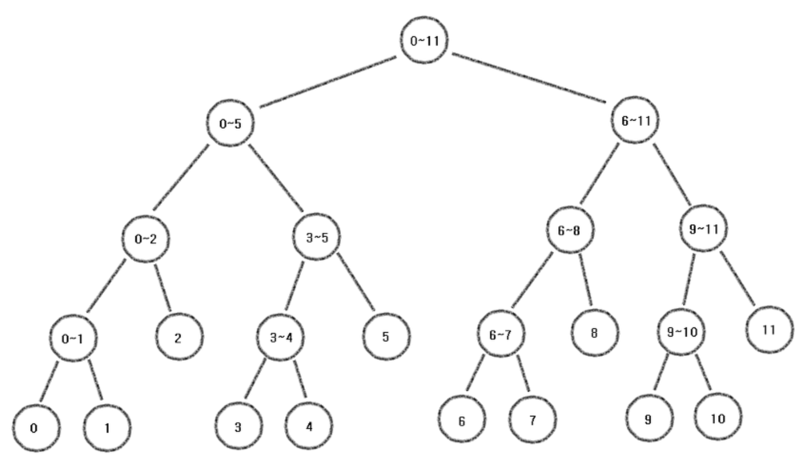
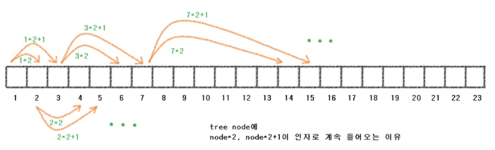

# Segment Tree (구간 트리)

## 구간 트리란?

* 주어진 쿼리에 대해 빠르게 응답하기 위해 만들어진 자료구조


## 시간 복잡도

* 일반적인 방법으로 구간의 합을 구하는 과정의 "**시간 복잡도**"
  * 수를 바꾸는 과정 : `O(1)`
  * 수를 더하는 과정 : `O(N)`
* Segment Tree를 이용하여 구간의 합을 구하는 과정의 "**시간 복잡도**"
  * 수를 바꾸는 과정 : `O(logN)`
  * 수를 더하는 과정 : `O(logN)`


## Segment Tree(구간트리) 모형



* `N=12` 인 경우의 Segment Tree
* `Leaf Node` : 처음 받아온 데이터
* `x ~ y` : x부터 y까지의 합


## Segment Tree의 전체 크기 구하기

```C++
int h = (int)ceil(log2(n));
int tree_size = (1 << (h+1));
```


## Segment Tree Node에 값들이 쌓이는 원리



* Segment Tree는 **Full Binary Tree**에 가까움.
* 현재 Node의 번호가 **`node`**인 경우 (**node는 1부터 count**)
  * **Left-node** : `node * 2`
  * **Right-node** : `node * 2 + 1`


## Segment Tree를 만드는 방법

* tree 배열 : Segment Tree가 만들어지는 배열
* arr 배열 : 처음에 입력받아 생성된 배열


1. **초기화 과정 (Initialize)** : 가장 초기 상태의 트리를 만드는 것

   ```C++
   ll init(vector<ll> &arr, vector<ll> &tree, int node, int start, int end)
   {
       if (start == end)
           return tree[node] = arr[start];
       
       int mid = (start + end)/2;
       return tree[node] = init(arr, tree, node * 2, start, mid)
           			 + init(arr, tree, node * 2 + 1, mid + 1, end);
   }
   ```

2. **갱신 과정 (Update)** : 값을 바꿀 때 트리를 수정하는 것

   ```C++
   void update(vector<ll> &tree, int node, int start, int end, int index, ll diff)
   {
       if ( !(start <= index && index <= end) )
           return;
       
       tree[node] += diff;
       if (start != end) {
           int mid = (start + end)/2;
           update(tree, node * 2, start, mid, index, diff);
           update(tree, node * 2 + 1, mid + 1, end, index, diff);
       }
   }
   ```

   * **`index`** : 값을 바꿔줄 위치의 **인덱스**
   * **`diff` = `new value` - `old value`**

3. **합 과정 (Sum)** : 주어진 구간의 합을 구하는 것

   ```C++
   ll sum(vector<ll> &tree, int node, int start, int end, int left, int right)
   {
       if (left > end || right < start)
           return 0;
       
       if (left <= start && end <= right)
           return tree[node];
       
       int mid = (start + end)/2;
       return sum(tree, node * 2, start, mid, left, right)
            + sum(tree, node * 2 + 1, mid + 1, end, left, right);
   }
   ```

   * left, right가 구하고자 하는 영역에 대한 인덱스
   * 합을 구하는 과정 : 4가지 경우


   **1) `[left, right]`와  `[start, end]` 가 겹치지 않는 경우**

   : 구하고자 하는 범위와 상관이 없는 경우

   ```C++
   if (left > end || right < start)
   ```


   **2) `[left, right]`가  `[start, end]`를 완전히 포함하는 경우**

   : 구하고자 하는 범위에 포함되는 경우

   ```C++
   if (left <= start && end <= right)
   ```


   **3) `[start, end]`가  `[left, right]`를 완전히 포함하는 경우**

   : 구하고자 하는 범위가 현재 구간 내부에 포함되어 있는 경우

   ```C++
   return sum(tree, node * 2, start, mid, left, right)
        + sum(tree, node * 2 + 1, mid + 1, end, left, right);
   ```


   **4) `[left, right]`와 `[start, end]`가 겹쳐져 있는 경우**

   : 서로 부분적으로 겹쳐있는 경우 (1, 2, 3을 제외한 나머지 경우)

   ```C++
   return sum(tree, node * 2, start, mid, left, right)
        + sum(tree, node * 2 + 1, mid + 1, end, left, right);
   ```


​	>> **결론적으로, 1은 그냥 빠져나가고, 2는 값을 리턴하고, 3, 4는 재탐색을 한다.**


## Source Code

```C++
#include <iostream>
#include <vector>
#include <cmath>
using namespace std;

typedef long long ll;

ll init(vector<ll> &arr, vector<ll> &tree, int node, int start, int end)
{
    if (start == end)
        return tree[node] = arr[start];
    
    int mid = (start + end)/2;
    return tree[node] = init(arr, tree, node * 2, start, mid)
        			 + init(arr, tree, node * 2 + 1, mid + 1, end);
}

void update(vector<ll> &tree, int node, int start, int end, int index, ll diff)
{
    if ( !(start <= index && index <= end) )
        return;
    
    tree[node] += diff;
    if (start != end) {
        int mid = (start + end)/2;
        update(tree, node * 2, start, mid, index, diff);
        update(tree, node * 2 + 1, mid + 1, end, index, diff);
    }
}

ll sum(vector<ll> &tree, int node, int start, int end, int left, int right)
{
    if (left > end || right < start)
        return 0;
    
    if (left <= start && end <= right)
        return tree[node];
    
    int mid = (start + end)/2;
    return sum(tree, node * 2, start, mid, left, right)
         + sum(tree, node * 2 + 1, mid + 1, end, left, right);
}

int main(int argc, char const *argv[]) {
    cin.tie(0);
    ios_base::sync_with_stdio(false);
    
    int n;
    cin >> n;
    
    vector<ll> arr(n);
    for (int i=0; i<n; ++i)
        cin >> arr[i];
    
    int h = (int)ceil(log2(n));
	int tree_size = (1 << (h+1));
    
    vector<ll> tree(tree_size);
    init(arr, tree, 1, 0, n-1);
    
    return 0;
}
```


## Segment Tree 관련 문제

* <https://www.acmicpc.net/problem/2042> 구간 합 구하기
* <https://www.acmicpc.net/problem/10868> 최소값 
* <https://www.acmicpc.net/problem/2357> 최소값과 최대값 
* <https://www.acmicpc.net/problem/6549> 히스토그램에서 가장 큰 직사각형 


> 출처 : https://www.crocus.co.kr/648?category=150836