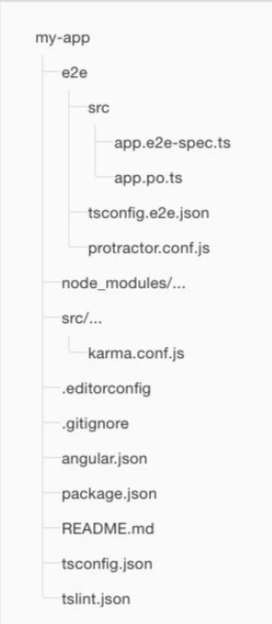
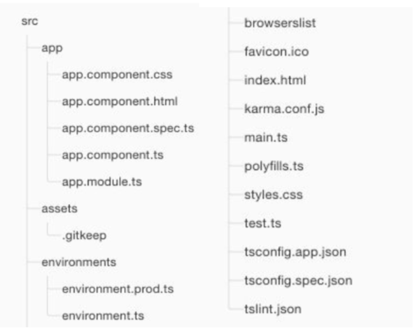

# Angular Basic

#### Angular should be installed 

* you should have succeeded in running **$ ng serve**


### TypeScript Basic

#### Types

1. Boolean

   ```typescript
   let isReady: boolean = false;
   ```

2. Number

   ```typescript
   let decimal: number = 10;
   let hex: number = 0xa;
   let binary: number = 0b1010;
   let octal: number = 0o12;
   ```

3. String

   ```typescript
   let language: string = "C";
   let introduction: string = 'Hello, I speak in ${ language }';
   introduction = 'I am ${decimal + 12} years old';
   ```

4. Array

   ```typescript
   let arr: number[] = [1, 2, 3];
   let arr2: Array<number> = [1, 2, 3];
   ```

5. Any

   ```typescript
   let notKnow: any = 'maybe';
   notKnow = 1;
   ```

6. Void

   ```typescript
   function alert(): void {
       alert("MESSAGE");
   }
   ```

7. There is also Tuple, Enum, Null, Undefined


#### Advanced Types

1. Trust Me Compiler (a.k.a. Type Assertions)

   ```typescript
   let strLength: number = (<string>someValue).length;
   let strLength: number = (someValue as string).length;
   ```

2. Interfaces

   ```typescript
   interface hero {
       name: string;
       optional?: any;
       readonly dontChange: number;
   }
   ```

3. Function

   ```typescript
   myFunc1 = function(arg1: string, arg2 = "hi"): string {
       Return arg1 + arg2;
   }
   myFunc2 = function(arg1: string, arg2?:string): string {...}
   myFunc3 = function(arg1: string, ...restOfArgs: string[]) {...}
   ```


#### Class

```typescript
interface ClockInterface {
    currentTime: Date;
    setTime(d: Date);
}

class Clock implements ClockInterface {
    currentTime: Date;
    setTime(d: Date) {
        this.currentTime = d;
    }
    constructor(h: number, m: number) { }
}
```

There is also inheritance, Abstract Class, Modifiers(public, private, protected) and so on.

Public by default!


#### Fat Arrow =>

```typescript
const func1 = function multiply(x: number, y: number): number {
    return x * y;
};

const func2 = (x:number, y:number): number => { return x * y };
const func3 = (x:number, y:number): number => x * y;
```


### Creating a new project

```bash
# create new angular project
$ ng new PROJECT_NAME

# move into PROJECT
$ cd PROJECT_NAME

# observe the directory
$ ls
```


### The root folder (reference)



* `e2e/`
  * Inside `e2e/` live the **end-to-end tests**. They shouldn't be inside `src/` because e2e tests are really a separate app that just so happens to test your main app. That's also why they have their own `tsconfig.e2e.json`.
* `node_modules/`
  * `Node.js` creates this folder and puts all **third party modules** listed in `package.json` inside of it.
* `angular.json`
  * **Configuration** for Angular CLI. In this file you can set several defaults and also configure what files are included when your project is built. Check out the official documentation if you want to know more.
* `.editorconfig`
  * **Simple configuration for your editor** to make sure everyone that uses your project has the same basic configuration. Most editors support an `.editorconfig` file. See http://editorconfig.org for more information.

* `.gitignore`
  * Git configuration to make sure autogenerated files are not commited to source control.
* `package.json`
  * `npm` configuration listing the third party packages your project uses. You can also add your own custom scripts here.
* `protractor.conf.js`
  * End-to-end test configuration for Protractor, used when running `ng e2e`.
* `README.md`
  * Basic documentation for your project, pre-filled with CLI command information. Make sure to enhance it with project documentation so that anyone checking out the repo can build your app!
* `tsconfig.json`
  * TypeScript compiler configuration for your IDE to pick up and give you helpful tooling.
* `tslint.json`
  * Linting configuration for TSLint together with Codelyzer, used when runing `ng lint`. Linting helps keep your code style consistent.


### The src folder (reference)



* `app/app.component.` {ts, html, css, spec.ts}
  * Defines the `AppComponent` along with an HTML template, CSS stylesheet, and a unit test. It is the root component of what will become a tree of nested components as the application evolves.
* `app/app.module.ts`
  * Defines `AppModule`, the root module that tells Angular how to assemble the application. Right now it declares only the `AppComponent`. Soon there will be more components to declare.
* `assets/*`
  * A folder where you can pu images and anything else to be copied wholesale when you build your application.
* `environments/*`
  * This folder contains one file for each of your destination environments, each exporting simple configuration variables to use in your application. The files are replaced on-the-fly when you build your app. You might use a different API endpoint for development than you do for production or maybe different analytics tokens. You might even use some mock services. Either way, the CLI has you covered.
* `favicon.ico`
  * Every site wants to look good on the bookmark bar. Get started with your very own Angular icon.
* `index.html`
  * The main HTML page that is served when someone visits your site. Most of the time you'll never need to edit it. The CLI automatically adds all `js` and `css` files when building your app so you never need to add any `<script>` or `<link>` tags here manually.
* `main.ts`
  * The main entry point for your app. Compiles the application with the JIT compiler and bootstraps the application's root module (`AppModule`) to run in the browser. You can also use the AOT compiler without changing any code by passing in `--aot` to `ng build` or `ng serve`.
* `polyfills.ts`
  * Different browsers have different levels of support of the web standards. Polyfills help normalize those differences. You should be pretty safe with `corre-js` and `zone.js`, but be sure to check out the Browser Support guide for more information.
* `styles.css`
  * Your global styles go here. Most of the time you'll want to have local styles in your components for easier maintenance, but styles that accect all of your app need to be in a central place.
* `test.ts`
  * This is the main entry point for your unit tests. It has some custom configuration that might be unfamiliar, but it's not something you'll need to edit.
* `tsconfig.{app|spec}.json`
  * TypeScript compiler configuration for the Angular app (`tsconfig.app.json`) and for the unit tests (`tsconfig.spec.json`).
* `browserslist`
  * A configuration file to share target browsers between different from-end tools.
* `karma.conf.js`
  * Unit test configuration for the Karma test runner, used when running `ng test`
* `tslint.json`
  * Additional Linting configuration for TSLint together with Codelyzer, used when running `ng lint`. Linting helps keep your code style consistent.


### Keep the App transpiling and running

```bash
# under root folder, keep the TypeScript compiler in "watch mode"
$ npm start

# you can check out your work on http://localhost:4200
```


### Get familiar with Angular-cli!

* https://cli.angular.io
* https://github.com/angular/angular-cli/wiki/stories
* https://github.com/angular/angular-cli/wiki/generate

Whenever creating new files in Angular, use `ng generate`


>  출처 : Seoul National University, Principles and Practices of Software Development