# Git Basic

### What is Git?

* One of the representative **Version Control Systems (VCS)**
* Install : http://git-scm.com/downloads
* Git may already be installed under certain OSs.
  * e.g. Latest version of Ubuntu has Git included in installation


### Fork

* Click on the fork button at the top of the screen
* Choose your own account


### Initialize or Clone Repository

* Initialization

```bash
$ mkdir testrepo
$ cd testrepo
# Initialize Git repository in current dir
$ git init
$ cd ..
```

* Clone

```bash
# Clone the forked remote repository
$ git clone https://github.com/YOUR_USERNAME/REPOSITORY_NAME.git
$ cd REPOSITORY_NAME
```


### Creating a file

* Create file

```bash
$ touch helloworld.py
```

```python
#!/usr/bin/python
print("Hello SWPP World!")
```


### Add a file to track

* Add file to track. Track is like a shopping cart, where you put stuff that you want to buy.

```bash
# Add the helloworld.py to git index
# After this point, helloworld.py is tracked by git
$ git add helloworld.py

# useful options of git add 
# . add all untracked files
$ git add .
```


### Show the working tree status

```bash
# Show current status of the branch
$ git status

# Result
# On branch master
#
# Initial commit
# 
# Changes to be committed:
#   (use "git rm --cached <file>..." to unstage)
#
#   new file:   helloworld.py
#
```


### Remove a file from track

* Create file

```bash
$ touch useless_file.txt
```

* Add file to track

```bash
$ git add useless_file.txt
$ git status
```

* Remove file from track

```bash
# Remove the file in both the index and the disk!
$ git rm useless_file.txt

# useful (optional) options of 'git rm'
# --cached     only remove from the index
# -f, --force  override the up-to-date check
# -r           allow recursive removal
```


### Record changes to the repository

* It's like 'wrapping a box', in which there are stuff that you've added to the track.

```bash
# Generate a new commit with comments
$ git commit -m "add helloworld"

# If you want to edit the current commit instead of generating a new commit, run 'git commit --amend'.
# Recommendation : Generate commits frequently, in small steps!

# Compare with previous status!
$ git status
```


### Committer settings

* The following message may appear if you have not set your comitter profile.
* Use the email you used to create your GitHub account.

```bash
# Committer: username <username@localhost.localdomain>
# Your name and email address were configured automatically based on your username and host name. Please check that they are accurate. You can suppress this message by setting them explicitly:
#
     $ git config --global user.name "Your Name"
     $ git config --global user.email you@example.com
#
# After doing this, you may fix the identity used for this commit with:
#
	 $ git commit --amend --reset-author
```


### Push changes to remote repository

* After 'wrapping the box', we should ship it!

```bash
# Ship the material to the remote repository
$ git push

# Check on https://github.com/USERNAME/REPOSITORY_NAME.
# You should see the changes updated online.
```


### Show commit logs

```bash
# Show commit logs
$ git log

# commit b742f4b0a7bbb76288efa2ddd3545d217fd4b298
# Author: (Username) <(UserMail)>
# Date:   Wed Mar 11 11:11:11 2015 +0900
#
#	1st commit
```


### Create and switch to a new branch

```bash
# Generate a new branch
$ git branch BRANCH_NAME

# Show a list of branches
$ git branch

# Delete the branch
$ git branch -d BRANCH_NAME
```

* It's like moving to another 'shopping cart', that you've created for some other reason.

```bash
# Checkout the branch to the working tree
$ git checkout BRANCH_NAME

# Generate a new branch and checkout the branch at once
$ git checkout -b NEW_BRANCH_NAME
```

* **Before starting team project, you may want to preconcert an example of a naming rule of branches**

  ​	example : initl (initial of your name) 

  ​			  - model (the part you changed) 

  ​			  - change column name (what you changed)


### Show changes between branches

```bash
# Create another file
$ touch helloworld.ts

# Generate a new commit
$ git add helloworld.ts
$ git commit -m "add typescript file"

# Compare between master and your current branch!
# You can always see which branch you are currently on, using the git status command.
$ git diff master

# You also can compare between commits, commit and branch, and so on
```


### Join two development histories together

```bash
# Switch to master branch again
$ git checkout master

# Merge your branch to master!
$ git merge BRANCH_NAME
```


### Fetch from and merge with remote branch at once

```bash
$ git remote add upstream https://github.com/USERNAME/REPOSITORY_NAME

# Fetch and merge the shared master branch at once!
$ git pull upstream master
```


### Update remote branch

```bash
# Switch to your branch
$ git checkout BRANCH_NAME

# YOUR TASK: Create a file printing "Bye World!", similar to the example provided previously
$ touch byeworld.py

# Upload updates of the local repository
$ git add .
$ git commit -m "add byeworld"
$ git push origin BRANCH_NAME
```


### Create a PR(Pull Request)!

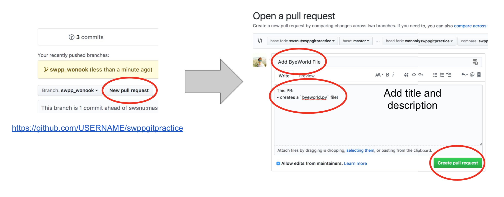

### Typical workflow

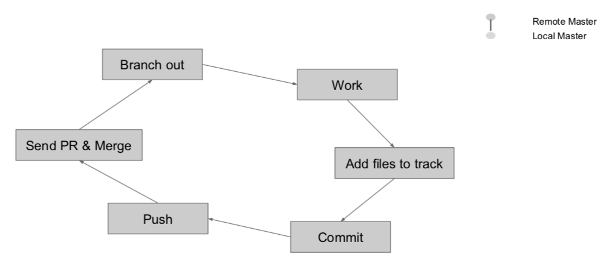

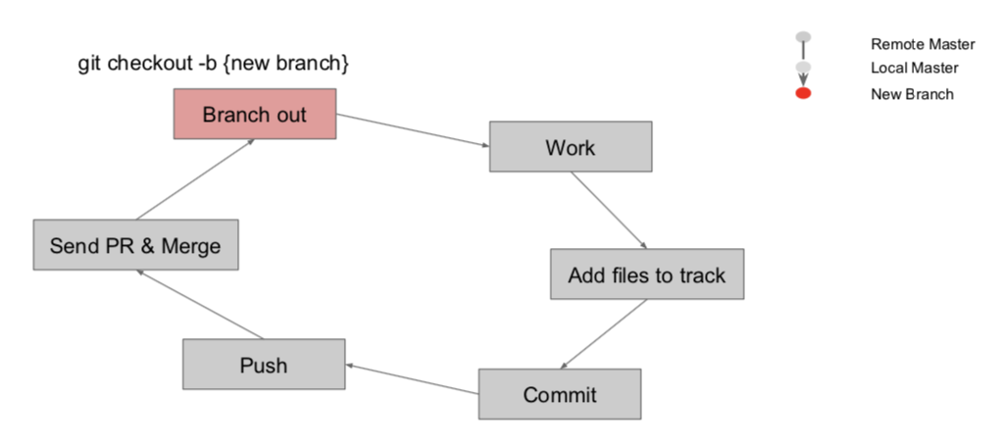

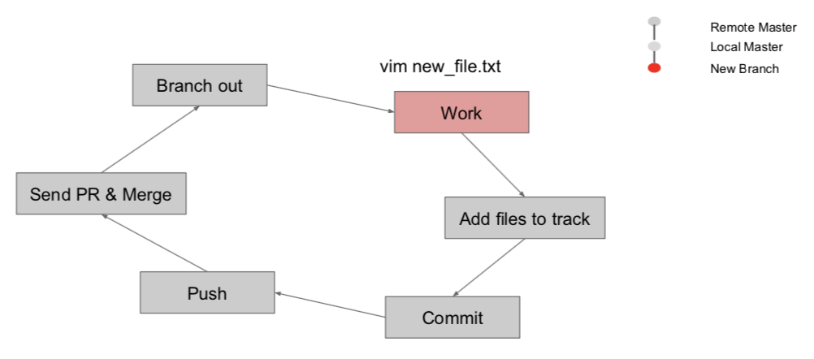

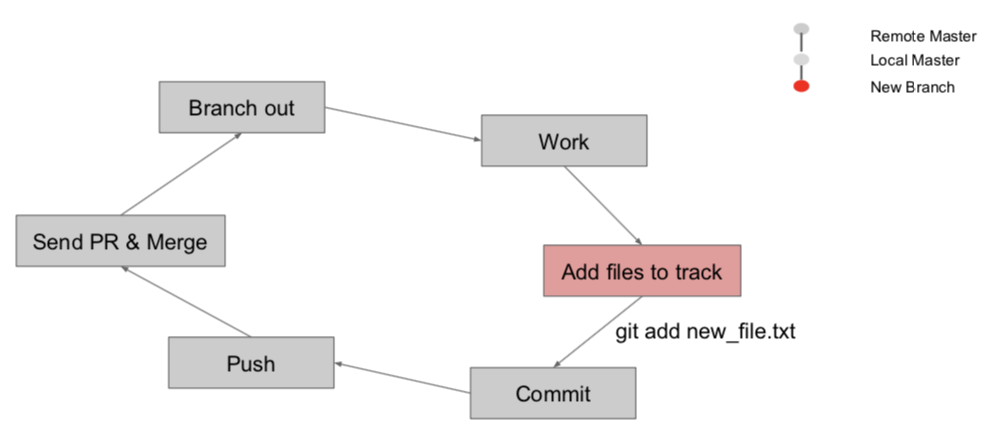

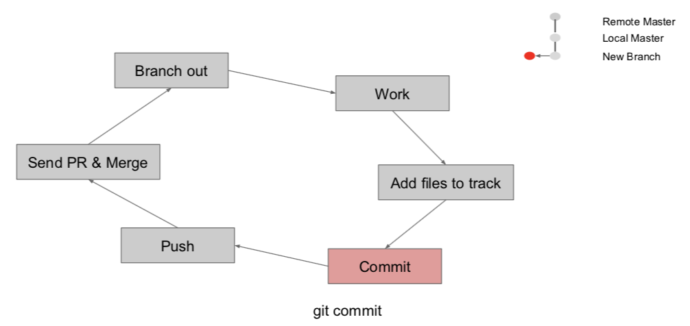

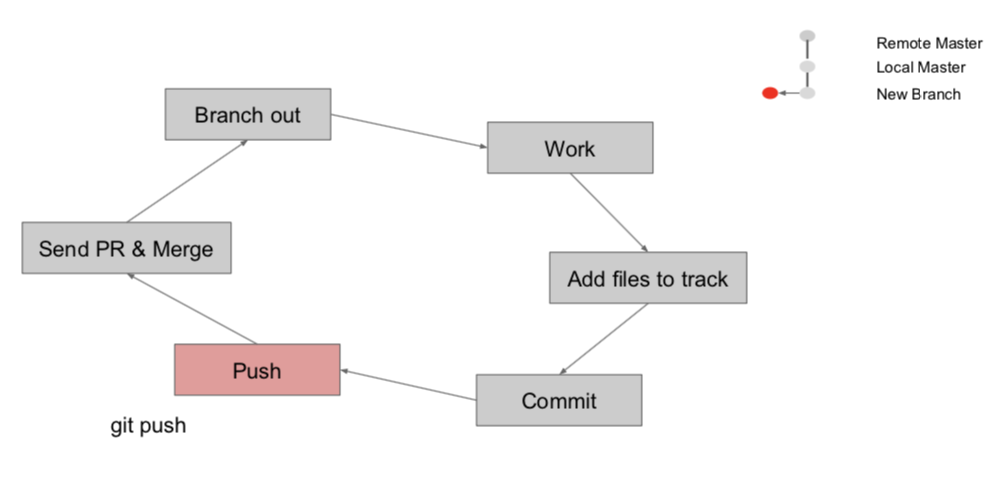

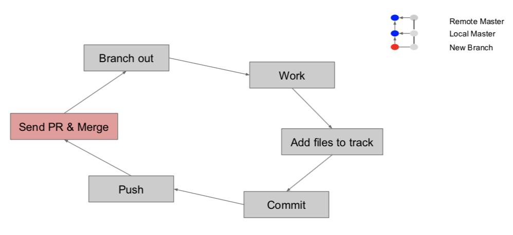

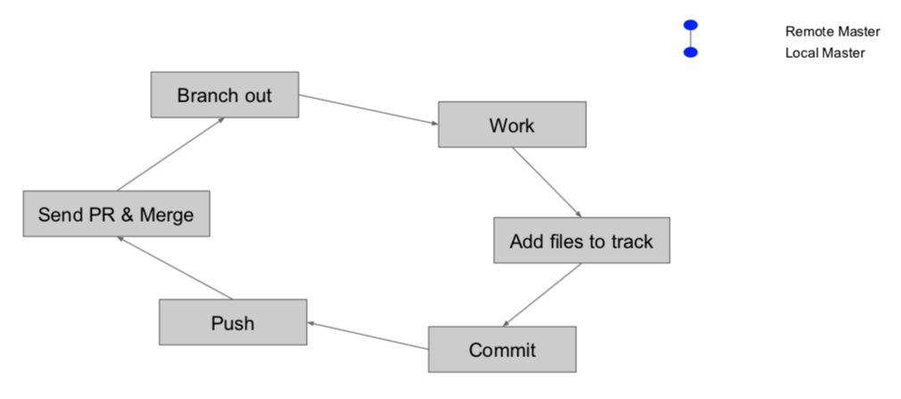


## GitHub

### What is Github?

* A popular web-based hosting service which supports storing and managing projects controlled by Git
* Basically, it's an online server (web) that stores your project files and version control (git) to be shared among your group of colleagues safely and reliably.
* www.github.com


### Managing your repository

* Issue
* Pull Request
* Wiki


### Copy and start from other user's repository

* fork


### Markdown language

* A markup language with plain text formatting syntax designed so that it can be converted to HTML
* Basic language for write github issue, pull request, wiki, README, and so on.


* https://help.github.com/articles/markdown-basics/
* https://help.github.com/articles/writing-on-github/
* https://help.github.com/articles/github-flavored-markdown/


### Advanced skills

```bash
# Adds a remote named <name> for the repository at <url>
$ git remote add name url

# Saves your local modifications away and reverts the working directory to match the HEAD commit
$ git stash

# Forward-port local commits to the updated upstream head
$ git rebase
```

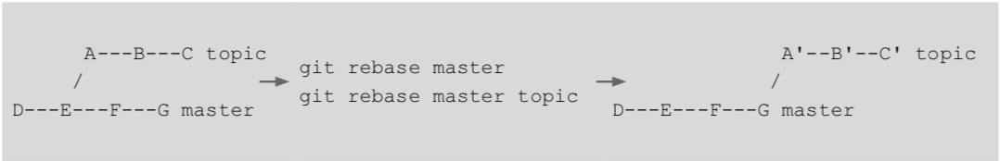


### Fixing committed mistakes

```bash
# Edit the file as you want
$ touch mistake.txt
$ git add mistake.txt
$ git commit -m "mistake commit"
$ git revert --no-edit HEAD
# Fix committed changes
# In this case, mistake.txt will be removed and new commit for reverting the original commit will be generated

$ git status
```

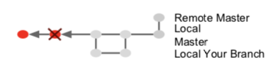
